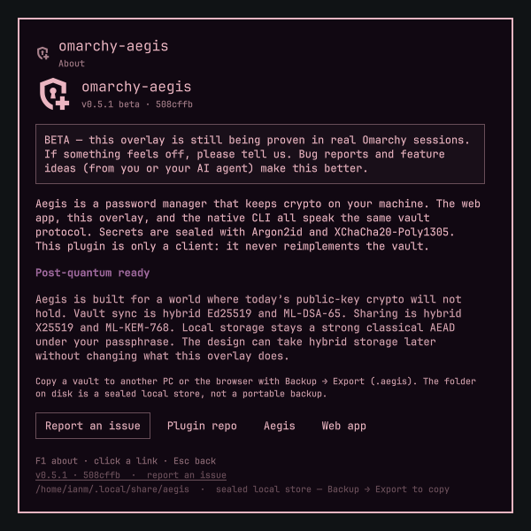

# omarchy-aegis

Your Aegis vault, summoned from the Omarchy bar. Search, copy, edit, lock with the session.



This is a **client of the native [`aegis`](https://github.com/imcmurray/Aegis) CLI**. Crypto stays in `aegis`. The overlay never reimplements Argon2, PQ KEM/signatures, or vault storage. It does not talk to `aegis-dev-vault-server`.

```
Omarchy overlay  →  aegis  →  aegis agent  →  ~/.local/share/aegis/secrets/
```

Unlock once. Search and copy hit the running agent. Argon2id (≥ 64 MiB) is not paid per keystroke.

**Beta v0.6.0.** Built for Omarchy Quattro. Feedback welcome — **About** (or F1) in the overlay, or [open an issue](https://github.com/imcmurray/omarchy-aegis/issues/new/choose).

## Install

Requires the **attested** [`aegis`](https://github.com/imcmurray/Aegis) linux-x86_64 CLI from the [v2.0.0-rc.1.1](https://github.com/imcmurray/Aegis/releases/tag/v2.0.0-rc.1.1) GitHub Release. The plugin opens candidate paths with `O_NOFOLLOW`, hashes the descriptor, and refuses anything whose SHA-256 is not in `cli.sha256`. Protocol version is a sanity check, not trust.

**No sudo or pkexec is required.** This plugin does not install packages or edit Hyprland/Omarchy config unless you add the optional keybind below.

```bash
tag=v2.0.0-rc.1.1
base=https://github.com/imcmurray/Aegis/releases/download/$tag
dir="${XDG_RUNTIME_DIR:?}/aegis-cli-$$"
mkdir -p "$dir"
curl -fsSL -o "$dir/aegis-x86_64-unknown-linux-gnu" "$base/aegis-x86_64-unknown-linux-gnu"
echo "05d6b776bac89cb9301231bcc51b579cc616811d876a32771861d06cb543b042  aegis-x86_64-unknown-linux-gnu" | (cd "$dir" && sha256sum -c -)
install -D -m 0755 "$dir/aegis-x86_64-unknown-linux-gnu" "$HOME/.local/bin/aegis"
rm -rf "$dir"
"$HOME/.local/bin/aegis" --protocol-version
```

The overlay **Copy install** button fills in the digest for you.

Then:

```bash
omarchy plugin add https://github.com/imcmurray/omarchy-aegis.git --enable
```

The padlock lands on the right of the bar. Click it, or:

```bash
omarchy-shell shell summon ianm.aegis '{}'
```

Optional keybind — you add this yourself; the plugin never writes `bindings.lua`:

```lua
o.bind("SUPER + SHIFT + P", "omarchy-aegis", "omarchy-shell shell summon ianm.aegis '{}'")
```

The plugin looks for an attested `aegis` at `/usr/bin/aegis`, `/usr/local/bin/aegis`, then `~/.local/bin/aegis`. Each candidate is opened from `/` with no-follow descriptors and accepted only if the fd SHA-256 matches `cli.sha256`. Commands run through `bin/aegis-run` in a closed environment (`PATH=/usr/bin:/bin`), with a deadline, output cap, and process-group TERM/KILL. If the CLI is missing or the digest does not match, the overlay shows the install commands, a copy button, and **Recheck**.

## What you get

- Overlay search: Enter copies the password (`aegis copy`, 30s wipe)
- Row **Edit** on hover or keyboard selection; Ctrl+N for a new entry
- Categories (Aegis folders), TOTP, notes, generated passwords
- Session lock, suspend, and logout lock the vault
- **Backup** exports/imports the same `.aegis` files as the [web app](https://imcmurray.github.io/Aegis/). Import into a **new** vault is the default. Import **over** an existing vault needs **Replace existing vault** (`aegis import --replace`, CLI `v2.0.0-rc.1.1` / `cd99293`). That is ordinary backup restore: **new `vault_id`**, new live passphrase (must differ from the backup passphrase). It is not Recovery Kit identity preservation.
- **About** explains Aegis, post-quantum hybrid crypto, and where to send feedback


The listing preview is the first-run create vault screen (`preview.png`). Extra shots live in `docs/screenshots/`.

## Keyboard

| | |
|---|---|
| Enter | Copy password |
| Ctrl+E / Ctrl+Enter | Edit selected |
| Ctrl+N | New entry |
| Ctrl+U / Ctrl+T | Copy username / TOTP |
| Ctrl+L | Lock |
| F1 | About |
| Esc | Back / dismiss |

## Remove

```bash
omarchy plugin remove ianm.aegis
```

That does not delete `~/.local/share/aegis/` or stop `aegis agent`:

```bash
aegis lock
aegis agent stop
```

## Security

- The CLI is an attested GitHub Release artifact. Runtime trust is the SHA-256 of an `O_NOFOLLOW` fd, not `PATH` and not `--protocol-version`
- Passphrases go through `--passphrase-file` as `/proc/self/fd/N` into a file created with `O_EXCL|O_NOFOLLOW` in a held 0700 `$XDG_RUNTIME_DIR/aegis-omarchy` directory (walked from `/`). Never argv or env
- Helpers are `/usr/bin/python3`, `/usr/bin/env -i`, `/usr/bin/setpriv`; `gdbus` / `dbus-monitor` / `omarchy-hyprland-session-locked` are root-owned `/usr/bin` fds
- Search lists metadata only — no passwords in the QML model
- Clipboard copy is `aegis copy`, not `printf secret | wl-copy`
- Plugins run unsandboxed inside `omarchy-shell`. Read the repo before `--enable`

Portable copy of a vault is **Backup → Export** (a `.aegis` file). `~/.local/share/aegis` is the sealed local store, not a file you copy to another PC.

CLI equivalent of the overlay’s Replace toggle (`aegis` `v2.0.0-rc.1.1`):

```bash
aegis import --replace \
  --backup-passphrase-file backup.pw \
  --new-passphrase-file live.pw \
  vault.aegis
```

The result is a **new live vault** (new `vault_id`). Recovery Kit + secret is what preserves identity.

## License

MIT. See `LICENSE` and `NOTICE`. The `encrypted_add` mark is Material Symbols (Apache-2.0, Google). No sudo or pkexec is required.
